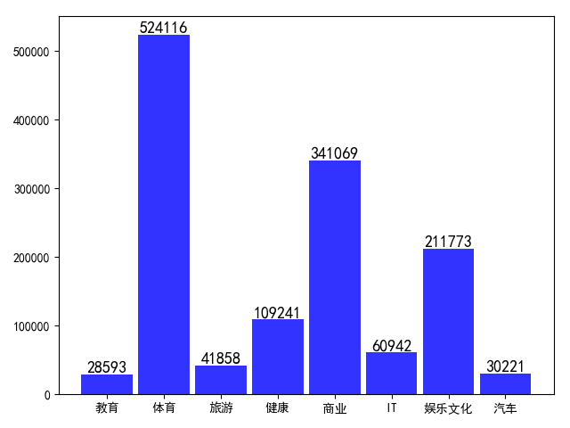

# 文本数据处理

使用搜狐新闻语料库训练中文文本分类模型，在处理数据的时候，发现文本不同样本的数量是不平衡的。

由上图可以看出，不同类别的样本数量差距很大。

PS:虽然程序上有分成30个类，但是实际上只有这8个。

基于样本量不平衡的问题，业界主要有以下几种处理方法：

1、对数据集进行重采样 
* 考虑对大类下的样本（超过1万、十万甚至更多）进行欠采样，即删除部分样本；
* 考虑对小类下的样本（不足1为甚至更少）进行过采样，即添加部分样本的副本；
* 考虑尝试随机采样与非随机采样两种采样方法；
* 考虑对各类别尝试不同的采样比例，不一定是1:1；
* 考虑同时使用过采样与欠采样。

2、从算法层面进行优化
* 重构训练集的方法。不改变已有算法，而是根据样本的不同错分代价给训练集中的每一个样本赋一个权值，接着按权重对原始样本集进行重构。 
* 引入代价敏感因子，设计出代价敏感的分类算法。通常对小样本赋予较高的代价，大样本赋予较小的代价，期望以此来平衡样本之间的数目差异。 
* 用bagging/ boosting/ ensemble等模型平均的方法。 
* 评价模型的方法。用confusion matrix, AUC/ROC等方法来评估模型。

3、尝试其它评价指标 

准确度这个评价指标在类别不均衡的分类任务中并不能work，因此，在不平衡的数据分布中，需要采用更加有效的评价指标，如何对不同的问题选择有效的评价指标参见
[这里](https://machinelearningmastery.com/classification-accuracy-is-not-enough-more-performance-measures-you-can-use/)。 

上面链接的文章，其推荐的评价指标有：
* 混淆矩阵(Confusion Matrix)：使用一个表格对分类器所预测的类别与其真实的类别的样本统计，分别为：TP、FN、FP与TN。
* 精确度(Precision)
* 召回率(Recall)
* F1得分(F1 Score)：精确度与找召回率的加权平均。
 
特别是：
* Kappa (Cohen kappa)
* ROC曲线(ROC Curves)

本文欲采用新的评价指标来处理样本不平衡问题。

