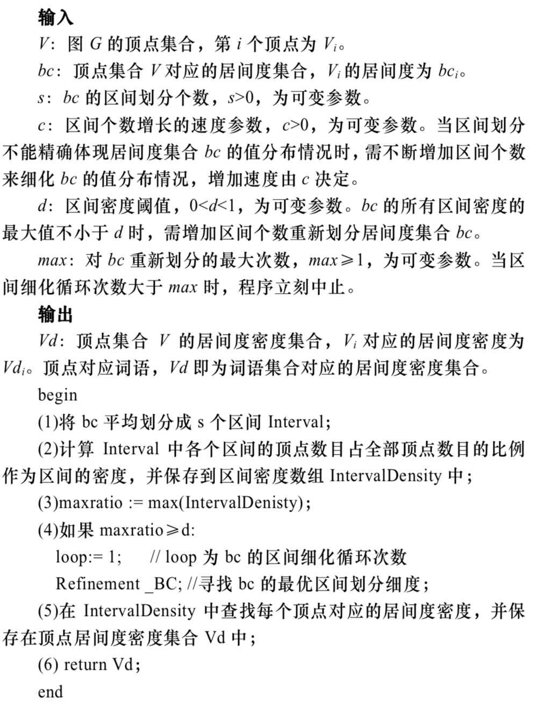
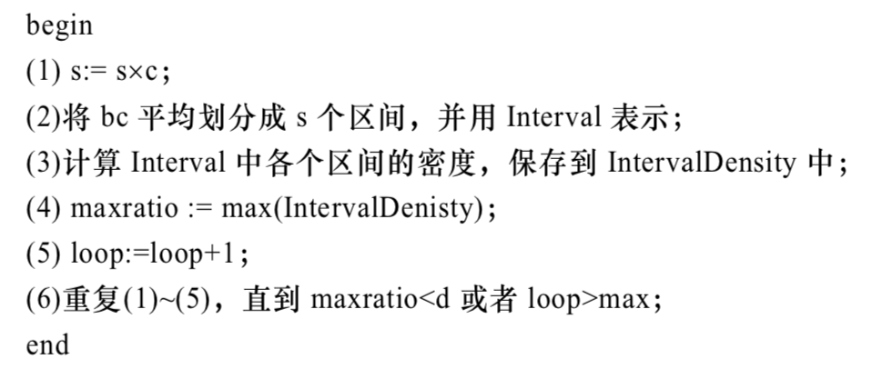

# 基于语义的中文文本关键词提取算法

## 常见的关键字提取方法
- 基于统计特征的方法，如词语频率统计；

  缺点：忽略出现频率不高或在文档中位置不重要但 对于文档具有关键意义的词语。
  
- 基于词语网络的方法，根据一定规则将文档映射为词语网络，利用词语网络计算词语的关键度；
  
  目前主流是将高频词语以及它们在同一窗口(邻接、句子、段落等) 的共现关系映射成词语网络。
  
  缺点：不能提取出对文档重要但频率不高的词语。根据词语的共现关系确定词语间的联系，缺乏语义理解，使得同主题但不在同一窗口的词语无法关联
  
- 基于语义的方法，利用词语的语义特征提取关键词。
  
  基于词语语义相似度将文档映射为一个词语语义相似度网络，结合社会网络理论，在词语语义相似度网络中使用居间度密度度量词语语义关键度，将词语语义关键度和词语的统计特征值加权获得关键词。
  
## 基于语义的关键词提取

### 词语语义相似度
词语间的语义相似度一般通过词语间的语义距离来描述，一种常见的语义距离计算方法是根据同义词词典 (thesaurus)求2个词语编码的距离。
中文常用的是一部类义词典——哈工大的《同义词词林》。
编码`!$Code_i$`描述为`!$Code_i=X_{i1}X_{i2}X_{i3}X_{i4}X_{i5}F_i$`。5 层代码 分别描述大类、中类、小类、词群和原子词群，F位标志位为“=”、“#”或“@”，其中，“=”表示同义;“#”表示同类， 属于相关词语;“@”表示词语自我封闭、独立，在词典中既 没有同义词，也没有相关词。

词语`!$W_1$`和`!$W_2$`的语义距离`!$Dis(W_1,W_2)$`定义为:

```markdown
Dis(W_1,W_2 ) = min_{i=1,2,⋯,m; j=1,2,⋯,n} Dis(Code_{1i},Code_{2j}) 
```
其中，m表示词语`!$W_1$`在《同义词词林》扩展版中的编码数量，n与m类似。

编码`!$Code_1$`和`!$Code_2$`的距离Dis(Code1, Code2)定义为：


其中weights表示相应编码的权重。weights= [w1, w2, w3, w4, w5, wF]，其中，w1>w2>w3>w4>w5>wF。
本文设置的权重值是[1.0, 0.5, 0.25, 0.125, 0.06, 0.03]。其含义是位于概念层次的越高层，其语义距离越大。`!$code_i$`中的i越大表示概念层次越低。
init_dis 为自定义距离初始值。本文中 init_dis取为 10。

W1 和 W2 的语义相似度 Sim(W1, W2)定义为：


其中：α 是一个可调节的参数，表示当相似度为0.5时的词语距离值。默认值为5。

## 词语语义相似度网络

一般而言，基于词语网络的关键词提取中，词语网络一般为**词语共现网络**。词语共现网络构建过程为:􏱄定一个窗口(邻接、句子、段落等)，若2个词语在同一窗口出现的频率大于设定阈值，则认为它们有联系存在“连接”。
但是在同一窗口内的所有词并不是都有联系，因此，使用词语语义相似度构建网络。

对于输入文档D，预处理后的词语集合是W，`!$W_i$`表示第i个词语，文档D对应的词语语义相似度网络图G定义为:
G={V,E}

其中：V表示图G的顶点集;`!$V_i$`表示V中第i个顶点;V与W中元素一一对应，即`!$V_i$`对应`!$W_i$`;E表示图G的边集。
如果2个顶点的语义相似度大于一定的阈值，则在这2个顶点之间添加一条无向边，即:

```markdown
E={(Vi, Vj) | Vi, Vj∈V, Sim(Vi ,Vj)>β}={(Vi, Vj) | Vi, Vj∈V, Wi, Wj∈W, Sim(Wi ,Wj)>β}
```

其中，0<β<1β越大，词语之间的语义关联要求越严格，则图G越稀疏，β默认为0.66。

## 居间度密度

在说居间度之前，先介绍下居间度。中心居间度是计算顶点中心性的一种方法，而顶点中心性是社会网络分析的一个重要方面。

顶点`!$V_i$`的居间度`!$bc_i$`定义为:

```markdown
bc_i=\sum^n_{m,k=1}\frac{g_{mk}(V_i)}{g_{mk}}
```

其中，n 为图 G 的顶点数目;`!$g_{mk}$` 表示顶点`!$V_m$` 和`!$V_k$`之间的最短路径数;`!$g_{mk}(V_i)$`表示顶点`!$V_m$`和`!$V_k$`之间的最短路径是否通过顶点`!$V_i$`，通过`!$V_i$` 则为1，否则为0。

顶点 Vi 的居间度密度，指将图 G 中所有顶点的 居间度集合平均划分成一定数目的区间后，顶点 Vi 的居间 度所在区间的顶点密度。



子算法Refinement_BC步骤如下：



不同的文档居间度分布情况不同，若采用相同的区间划 分数目，会造成一些文档的居间度集合划分细度不够。
因此需要动态调整bc的区间划分数目。
其策略为：

(1)设置阈值 d，控制居间度集合的划分细度。算法运行 过程中循环地判断当前居间度集合的划分细度是否满足区间 密度阈值 d，如果不满足，则将区间个数增加到原来的 c 倍， 对 bc 重新划分。

(2)设置中止参数 max，控制居间度集合的重新划分次数。 在实验过程中发现:小部分文档的区间细化循环在可接受的 时间和空间范围内无法停止，甚至造成程序无响应。通过对 这些文档分析发现:这部分文档的居间度集合中存在小部分 极大值或者极小值，在可接受的时间和空间范围内无法找到 满足阈值 d 的最优区间划分。为此，算法设置了区间细化过 程中止参数 max，当区间细化循环次数大于 max 时，程序立 刻中止，保证程序的运行时间和空间都维持在可接受范围

其中这些参数的默认值为：s=10，c=5，d=0.8，max=6。

