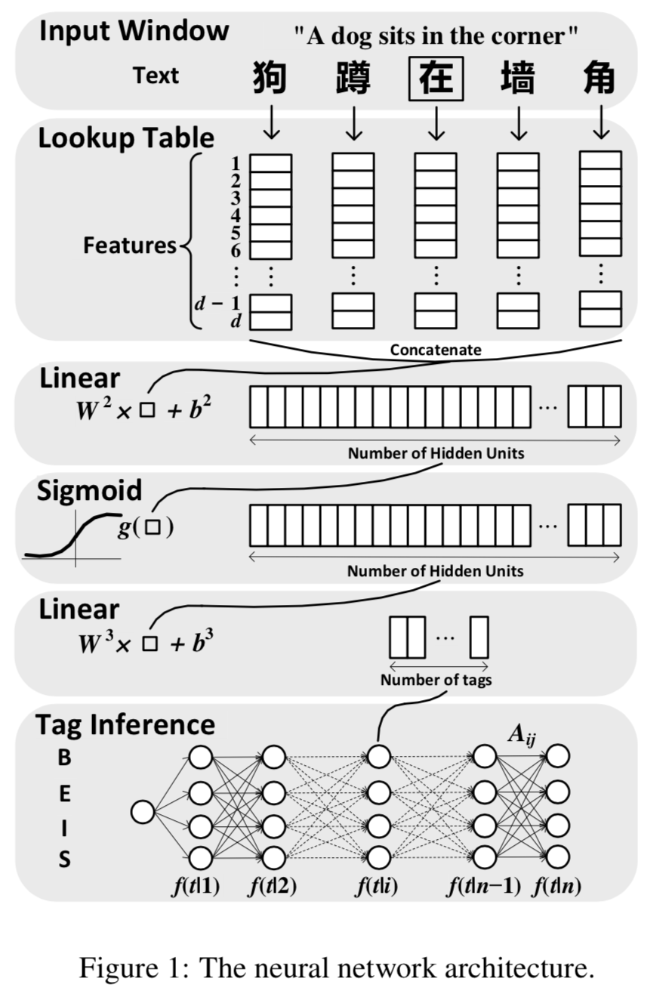
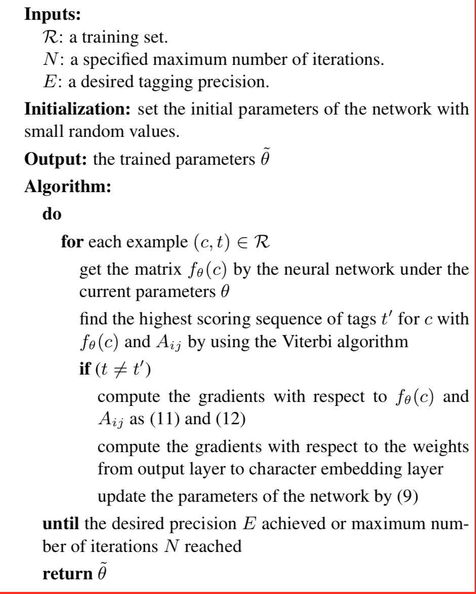

# 目前对中文分词工具
- 中科院计算所[NLPIR](https://link.zhihu.com/?target=http%3A//ictclas.nlpir.org/nlpir/)
- [ansj分词器](https://github.com/NLPchina/ansj_seg)
- 哈工大的[LTP](https://github.com/HIT-SCIR/ltp)
- 清华大学[THULAC](https://github.com/thunlp/THULAC)
- [斯坦福分词器](https://nlp.stanford.edu/software/segmenter.shtml) -- [NLTK](https://github.com/nltk/nltk)
- [Hanlp](https://github.com/hankcs/HanLP)分词器:求解的是最短路径。优点：开源、有人维护、可以解答。原始模型用的训练语料是人民日报的语料，当然如果你有足够的语料也可以自己训练。
- 结巴分词[jieba](https://github.com/yanyiwu/cppjieba):基于前缀词典实现高效的词图扫描，生成句子中汉字所有可能成词情况所构成的有向无环图 (DAG)；采用了动态规划查找最大概率路径, 找出基于词频的最大切分组合；对于未登录词，采用了基于汉字成词能力的HMM模型，使用了Viterbi算法。
- [KCWS](https://github.com/koth/kcws)分词器(字嵌入+Bi-LSTM+CRF)
- [ZPar](https://github.com/frcchang/zpar/releases)
- [IKAnalyzer](https://github.com/wks/ik-analyzer)

# 中文分词相关论文
中文不像英文有天然的空格进行分词，所以分词是中文文本处理的关键的重要步骤。

## Chinese Segmentation and New Word Detection using Conditional Random Fields
本文介绍的是利用条件随机场进行中文分词和新词发现。

传统的中文的分词主要有两种策略：\
一是以基于启发式字典的方法；\
二是统计机器学习方法。

## Deep Learning for Chinese Word Segmentation and POS Tagging

传统的中文分词方法，要引入大量的特征，这会导致其应用范围的局限性。\
1、结果模型可能太大以至于在正式的有限环境中无法存储或者计算。\
2、训练参数太多，容易在训练模型中造成过拟合。\
3、可能需要花费大量的训练时间。\
4、由于解码器面临大的搜索空间，因此动态编程技术的解码可能是难以处理的。

大部分表现良好的方法，都是将经过精挑细选的特征应用到线性统计模型中去。之所以说这些特征是经过精挑细选的，
是因为它们融入了大量的语法知识。但是精挑细选的特征，如果应用到其他更加复杂的场景中，表现就没有那么好了。

本文提出的算法的主要贡献在于：\
1）使用感知机算法训练训练神经网络，这样不仅能快速训练神经网络，而且能更加容易应用到其他环境中。\
2）中文分词和词性标注两者任务使用神经网络训练也有很好的表现。

### 神经网络结构
传统的分词或者词性标注算法，比如CRFs算法，严重依赖于特征的选择，需要大量的做特征工程，虽然特征工程很
重要，但是其将耗费大量的劳动，特别是需要依赖人类的灵感和语法知识。

因此本文提出的算法，减少了对特征工程的依赖，选择了一种可变的神经网络结构。

本文提出的神经网络主要有四层。\
1、第一层主要是对每个中文字符提取特征；\
2、第二层主要是对中文字符采用滑动窗口方式提取特征;\
3、第三层就是典型的神经网络层;\
4、第四层就是输出层，使用维特比算法实现标签推断的图。

#### 将字符映射成特征向量
字符嵌套矩阵M \in R^\{d X |D|\}。其中D是固定大小的字符词典，d表示字符向量的维度。|D|表示字典的大小。

每个字符的特征向量一般都是随机初始化的。

在实际中，还会提供而外的字符特征，比如在命名实体中，会查看该字符是否在命名实体表中；
或者提供一些统计特征，比如boundary entropy或accessor variety等普遍应用到非监督的中文分词模型中。
本文提到的算法也会将每个而外的特征映射成一个lookup table。那么字符向量就是所有这些lookup tables的结合体。

### Tag scoring

这一步是利用滑动窗口产生神经网络的固定大小的输入。窗口的大小为w，即利用中心词的上下文w/2个词组成
的输入矩阵。经过两层的标准的线性层，和一层非线性层的计算。最后再用线性层产生单个字符在标签集上概率值。
非线性层选用的是sigmoid函数。

### Tag Inference

通过上一步，我们计算出来每个字符的属于每个标签的概率值。这一步就要推断出该字符的的标签值。
由于在分词和词性标注上，相邻字符具有很大的依赖性。
本文引入了转移分数A_ij，表示从标签i转移到标签j；初始分数A_0i表示句子从标签i开始。

对于给定到句子c[1:n],神经网络的输出的得分矩阵为ƒ_θ(c[1:n])。我们使用ƒ_θ(t|i)表示神经网络在输入句子中，
第i个字符为标签t的分数。

对输入句子c[1:n]，其标签路径为t[1:n]。

s(c[1:n],t[1:n],θ)=∑^n_\{i=1}(A_\{t_\{i-1}t_i} +ƒ_θ(t_i|i))

对输入句子c[1:n]，其最好对路径为：

t'[1:n]=argmax_t' s(c[1:n],t'[1:n],θ)

寻找路径问题，可以使用Viterbi算法。

### Training

本文使用极大似然函数来训练该模型。\
θ --> ∑log p(t|c,θ)\
这表示所有句子的对数似然的和。p(.)表示单个句子的神经网络输出结果。使用梯度下降法来更新模型参数。

θ <-- Θ + λ(∂log p(t|c,θ))/∂θ

其中λ是学习率。
这个梯度更新方式就是典型的后向传播算法。

句子水平上的对数似然

单个句子的似然函数,句子的真实路径t的条件概率为：\
log p(t|c,θ)=s(c,t,θ)-log(∑exp_t'(s(c,t',θ)))

s(c,t,θ)表示真实路径上的前向分数；\
log(∑_t' exp(s(c,t',θ)))表示所有可能路径指数和的对数。

但是像上面这种使用对数似然cost函数，其计算量将随着输入句子的长度增加呈指数增长。
因此，本文提出了一种新的训练方法。

当给定输入语句(c,t)，神经网络的输出矩阵为：f_θ(c)。对于输入句子的最优标签序列可以使用Viterbi算法找到。
假设最优的标签序列为t'。

对于t_i≠t'_i的字符c_i；

当t_\{i-1}≠t'_\{i-1}或者t_i≠t'_i时；

其中++表示值增加1，--表示值减少1。L_θ(t,t'|c)是一个新的目标函数，可以被视为正确路径和误差路径的差值，所谓的误差路径就是神经网络训练出来的得分最高的路径。

图中的公式11和公式12指的是上面两个公式。公式9指的是\
θ <-- Θ + λ(∂log p(t|c,θ))/∂θ

