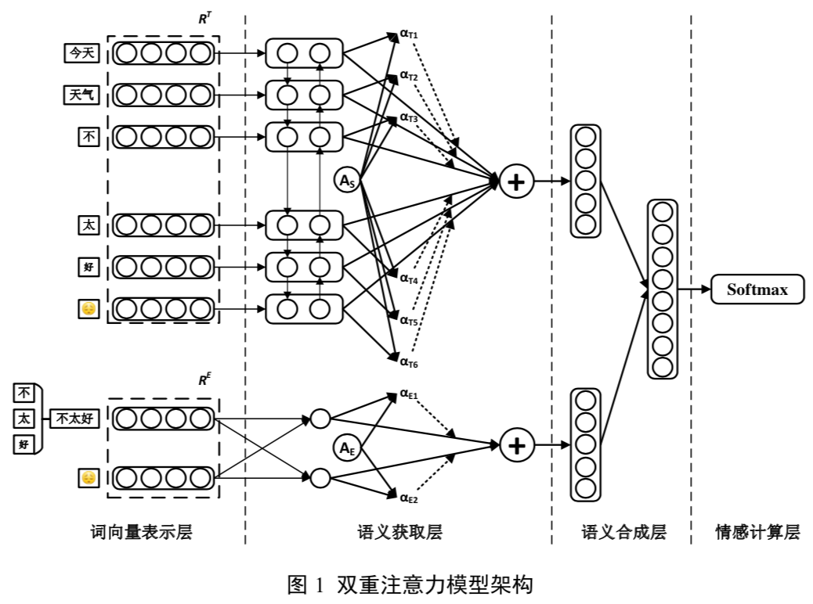

# 情感分析

## 数据集

知网情感分析用词语集[本地地址](NLP/datasets/sentiment/hownet),点击下载[地址](http://www.keenage.com/html/c_bulletin_2007.htm)。

台湾大学简体中文情感极性词典[本地地址](NLP/datasets/sentiment/ntusd)。

程度副词[本地地址](NLP/datasets/sentiment/advdegree)

情感词汇本体的数据集[本地地址](NLP/Dataset/sentiment/情感词汇本体/情感词汇本体.xlsx)

大部分词汇是从[github](https://github.com/data-science-lab/sentimentCN/tree/master/dict)上下载的。


# 基于双重注意力模型的微博情感分析方法

该方法首先利用现有的情感知识库构建了一个包含**情感词**、**程度副词**、**否定词**、**微博表情符号**
和**常用网络用语的微博情感符号库**;然后，采用**双向长短记忆网络模型和全连接网络**，
分别对**微博文本和文本中包含的情感符号**进行编码;接着，采用**注意力模型**分别构建微博**文本和情感符号**的语义表示，
并将两者的语义表示进行融合，以构建微博文本的最终语义表示;最后，基于所构建的语义表示对情感分类模型进行训练。

## 情感分析简要
情感分析研究主要包括

1）情感识别又称为主客观分类，主要是识别文本中的主观文本，为后续进一步的情感分析奠定基础。

2）情感极性分析：是将情感分为正向和负向两类或者正向、负向和中性三类。

3）细粒度的情感分析：对情感细粒度的类别暂时还没有统一的标准，有 6 类、12 类、18 类甚至 24 类等多种分类方法。
目前在中文情感分析领域应用比较多的是大连理工大学信息检索研究室的7大类21小类的情感分类体系，
7大类情感分别为乐(happiness)、好(like)、 怒(anger)、哀(sadness)、惧(fear)、恶(disgust)、惊(surprise)。

## 情感分析技术
情感分析技术主要分为三种:

1）基于情感知识的方法：主要是构建一些情感词典，通过情感词典对文本中的情感词进行一定的组合计算，实现对文本情感的分析。

2）基于特征分类的方法：主要是采用文本分析技术，提取文本中蕴含的相关语言特征，采用机器学习的方法将情感分析看作分类问题进行处理。
这种方法对于情感特征提取方法的依赖性较大，提取情感特征的好坏将直接影响到最终的分类结果。

3）基于深度学习的方法：主要是采用词向量表示技术，对文本中的词语进行表示，进而构建句子和篇章的语义表示。
在**句子和篇章的语义表示**的基础上，采用深度学习模型对文本中蕴含的情感进行学习，从而实现文本情感的分析

## 情感符号的提取
规则 1:若当前词语为情感词、表情符号和网络用语，直接将当前词语加入到情感符号集合中。

规则 2:若当前词语为程度副词，且当前词语的下一个词语为情感词，则将当前程度副词和情感词作为一个整体加入到情感符号集合中，若情感词存在于情感符号集合中，则将其 删除。

规则 3:若当前词语为否定词，且当前词语的下一个词语为情感词，则将当前否定词和 情感词作为一个整体加入到情感符号集合中，若情感词存在于情感符号集合中，则将其删除; 或者当前词语的下一个词语为程度副词，并且程度副词的下一个词语为情感词，则将当前否 定词和程度副词以及情感词作为一个整体加入到情感符号集合中，若程度副词与情感词的整 体存在于情感符号集合中，则将其删除。


## 双重注意力模型(DAM)架构



从上图可知：DAM架构可以划分为词向量表示层、语义获取层、语义合成层、情感计算层。

### 词向量表示层
词向量表示层为整个模型的输入，主要包括两部分:每一条微博文本词语的词向量矩阵`!$R^T$`和情感符号集合的词向量矩阵`!$R^E$`。

词向量矩阵是由事先训练好的词向量模型得到。

对 于一个文本序列`!$T={w_1,w_2,...,w_n}$`，通过将文本中词语的词向量拼接起来，就可以得到整个文本序列的词向量表示如式

```
R^T=v_1 \bigoplus v_2 \bigoplus ... \bigoplus v_n
```

其中，`!$vi\in i^{d x D }$` 表示wi应于词典中的元素，d表示词向量的维数，N表示词典中词语的个数。

情感符号集合`!$R^E$`序列的词向量表示同样采用上式的方式进行拼接。

### 语义获取层

对微博文本词语采用BLSTM和注意力模型进行语义编码；对情感符号集合，采用全连接网络与注意力模型相结合的方式进行语义编码。

由于每条微博文本中的每个情感符号之间只是具有情感加强和减弱的功能，如相同极性 的情感符号同时出现或是出现增强性的程度副词，情感将会得到加强;
相反极性的情感符号 同时出现或是出现减弱性的程度副词或者否定词，情感将会得到减弱甚至反转，情感符号相 互之间并不存在较强的语义依赖关系，因此，
采用全连接网络对情感符号集合进行非线性变换，进行最初的语义编码。


为了捕获更直接的语义依赖关系，将微博文本BLSTM模型的输出和情感符号集合全连接的输出分别输入到注意力模型中，采用双重注意力模型分别对微博文本和情感符号进行编码。

注意力模型通过对每一个输入状态`!$h_t$`进行加权，从而实现为输入文本构造一个上下文相关的文本表示向量v如下式所示：

```
v=\sum_{t=1}^T \alpha_t h_t
```

其中,T为输入状态的数目，`!$\alpha_t$`为输入状态`!$h_t$`的权重，与标准的注意力模型不同的是，本文注意力模型中的`!$\alpha_t$`与每一时刻的输入
状态和一个随机初始化的上下文向量A有关，A可以看作是对输入的一种表示。

```
\alpha_t=\frac{exp(e_t^T A)}{\sum^T_{k=1}exp(e_k^T A)}
e_t=Tanh(Wh_t+b)
```
W 为模型中的权重，b 为模型中的偏置，两者和**A**一起作为模型训练过程中的参数，通过不断训练学习得到

### 语义合成层

通过语义获取层，分别为`!$R^T$`和`!$R^E$`进行语义编码，构建其语义表示矩阵`!$S^T$`和`!$S^E$`。`!$S^T$`和`!$S^E$`中包含了微博文本的重要情感语义信息。

语义合成层的主要任务是将`!$R^T$`和`!$R^E$`进行合并，构建微博文本整体的语义表示向量。在本文中，为了简化模型的计算量，仅对`!$R^T$`和`!$R^E$`
采用按行连接的方式进行语义合并，构建一 个(`!$rows_T$`+`!$rows_E$`)×cols 的矩阵S，对微博文本进行语义表示，其中`!$rows_T$`和`!$rows_E$`
表示`!$R^T$`和`!$R^E$`的行数，cols表示`!$R^T$`和`!$R^E$`的列数。

### 情感计算层

情感计算层的主要任务是构建情感分类器，获取微博文本的语义表示S对于每一个情感标签的得分向量，并输出微博文本的最终情感标签。我们采用Softmax分类器
构建每一个情感标签的得分向量。

采用对数损失函数来衡量情感标签的真实概率分布`!$P_i^t(d)$`和预测的概率分布`!$P_i^p(d)$`之间的差距。

```
loss=-\sum_{d \in T}\sum^T_{i=1}P_i^t(d) log(P_i^p(d))
```

其中，T 为训练数据集，d 为 T 中的一篇微博文本。


